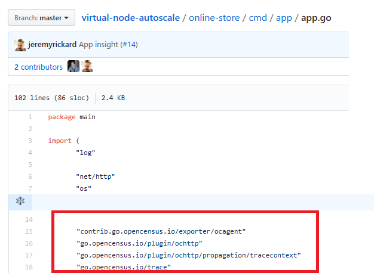

## Open Census at Microsoft Ignite

### Introduction
Just three months ago [we announced that Microsoft joined the OpenCensus project](https://open.microsoft.com/2018/06/13/microsoft-joins-the-opencensus-project/), and last week at [Microsoft Ignite](https://www.microsoft.com/ignite) we were able to share a few more details about how OpenCensus will be leveraged and advanced.

### OpenCensus spotlight

During Ignite's keynote, Microsoft announced support for Azure Kubernetes Service (AKS) Virtual Nodes. Virtual Nodes allow applications to scale more quickly, in a matter of mere minutes. The demonstration included a highlight of Azure Monitor for Application's [Live
Metrics Stream](https://docs.microsoft.com/azure/application-insights/app-insights-live-stream).

The keen eyed among you may have noticed that this demo is powered by [OpenCensus](https://github.com/Azure-Samples/virtual-node-autoscale)!

As mentioned in the demo itself, Azure provides users the freedom to either leverage the features and power built into Azure Monitor, or to easily provide their own tooling within Azure. This aligns perfectly with the the benefits of OpenCensus and its community oriented, vendor neutral approach.

Along with being featured in one of the keynote demos, Microsoft made a few other OpenCensus related announcements at Ignite.

### Better Go and Python support

Included in the detailed list of ["new monitoring capabilities"](https://azure.microsoft.com/blog/new-full-stack-monitoring-capabilities-in-azure-monitor/) is the note that Azure Monitor for Applications now delivers better support for Go and Python applications. This is accomplished through the combination of OpenCensus and Microsoft's telemetry routing agent called Local Forwarder.

Details are available in [Azure Monitor's distributed tracing documentation](https://docs.microsoft.com/azure/application-insights/distributed-tracing#enable-via-opencensus).

This announcement represents an important milestone: It not only enables support for Python and Go developers within Azure, but it also marks the first major contribution and collaboration between Microsoft and the OpenCensus community.

But this is not the only OpenCensus related news coming out of Microsoft.

### Call for standardization

OpenCensus simplifies the design of monitoring systems and opens the door for expanded polyglot scenarios and innovation. The power of these scenarios is of course amplified with support from the open source community, but also through efforts to bring unification and standardization across observability vendors.

To that end, it is a fundamental principle of OpenCensus to strive for consistency across our libraries thru specifications. Microsoft has contributed to those efforts by contributing a test harness to help ensure compliance with the [Trace Context](https://github.com/w3c/distributed-tracing) propagation format, as well as Trace Context implementation to several OpenCensus language libraries. Microsoft will continue to champion open standards through participation in the W3C Distributed Tracing Working Group and W3C TPAC event in France this month.

### Summary

We at Microsoft are excited to be traveling down this path towards better monitoring and observability for everybody. We thank all those in the OpenCensus community for the support and collaboration! The future is looking bright!

By Sergey Kanzhelev and Nik Molnar, Microsoft.
